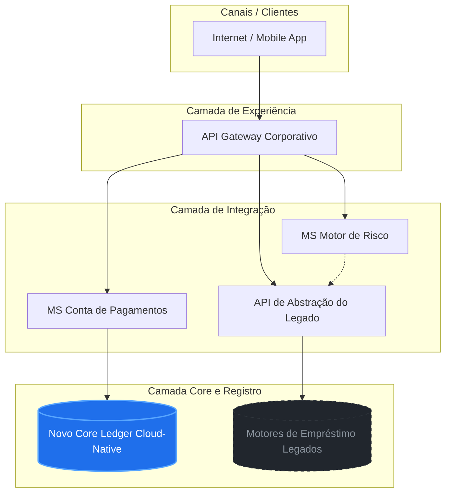

# ADR 001: Modernização do Core Bancário e Expansão de Portfólio (Conta de Pagamentos)

## Cabeçalho de Governança (Parecer Técnico)
* **Status:** Aprovado (Recomendação Oficial / Direcionamento Estratégico)
* **Data:** Setembro de 2026
* **Preparado por:** Time de Enterprise Architecture (EA)
* **Destinatários:** C-Level, CTO e CIO
* **Escopo:** Avaliação de Conta de Pagamentos vs. Cashback, Plataforma de Core Bancário e Quebra de Silos Legados.

---

## 1. Contexto e Mapa de Problemas (The Context)
Este item consolida a análise holística das capacidades e restrições atuais do Banco Paulista de Expansão.

### 1.1 Análise de Domínio (Domain-Driven Design)
Para organizar a complexidade atual e o novo cenário, o banco foi dividido sob a ótica de subdomínios DDD:
* **Crédito e Empréstimos (CDC, Pessoal, Consignado, Garantias):** *CORE DOMAIN (Diferencial)*. Atualmente construído em silos verticais isolados. Apresenta alto custo de manutenção e sem reaproveitamento de componentes de cálculo ou motores de crédito, impactando severamente o Time-to-Market de novos produtos.
* **Conta de Pagamentos (Novo Produto solicitado):** *CORE DOMAIN (Alvo)*. Inexistente no momento. Irá atuar como principal ponto de contato e atração de depósitos de baixo custo (funding) para alavancar a operação de crédito.
* **Cashback e Parcerias (Produto Alternativo):** *SUPPORTING (Suporte)*. Gera engajamento, mas depende de transacionalidade prévia. Isolado, não resolve o problema estrutural de retenção ou funding do banco.
* **Core Transacional / Ledger (Saldos e Lançamentos):** *GENERIC (Genérico)*. Inexistente para contas. A provocação do CTO faz sentido ao buscar uma plataforma de mercado (SaaS/Cloud-Native) para este fim genérico, liberando a engenharia interna para focar no Core Domain.

### 1.2 O Desafio do Core Bancário e a Visão do CTO
A provocação do CTO sobre o lastreio da plataforma é válida, mas requer um ajuste de escopo arquitetural. Substituir o legado inteiro por um Core tradicional geraria um projeto de alto risco ('Big Bang') de 3 a 5 anos, o que inviabilizaria a velocidade exigida pelo negócio.

---

## 2. Decisão Arquitetural (The Decision)
A EA recomenda formalmente a priorização da **Conta de Pagamentos** sobre o Cashback e a adoção de uma abordagem de **Core Bancário Modular de Nova Geração (Next-Gen Core) focado em Ledger**. 

Fica deliberada a **aquisição de uma plataforma moderna de Core Ledger Cloud-Native / API-First baseada em microsserviços via APIs** para suportar unicamente a Conta de Pagamentos. 

### Estilo Arquitetural Preservado:
* **Microsserviços e EDA:** O novo ecossistema respeitará estritamente a arquitetura descentralizada existente, quebrando os silos operacionais através de um modelo de *Bounded Contexts* e barramento de eventos (*Event-Driven Architecture*).

### Estratégia de Convivência com o Legado:
* Os produtos de empréstimos legados continuarão rodando temporariamente nos seus motores atuais, mas passarão a interagir com o ecossistema através de uma **camada unificada de APIs de Integração**.

---

## 3. Justificativa e Lastreio do Negócio (The Justification)
A escolha do produto e o desenho técnico possuem sustentação em três pilares econômicos e operacionais:
1. **Geração de Funding:** A conta de pagamentos permite a captação de depósitos à vista. Esse capital reduz drasticamente o custo de captação (funding) do banco, aumentando a margem líquida (spread) das operações de empréstimos, que são o atual motor financeiro da empresa.
2. **Frequência de Uso (Engajamento Real):** Clientes usam cashback pontualmente. A conta corrente/pagamento é utilizada diariamente (Pix, pagamento de boletos, transferências), criando uma volumetria de dados de comportamento essencial para refinar os modelos de score de crédito do banco.
3. **Prontidão para Cross-Sell:** É infinitamente mais natural ofertar um Crédito Consignado ou Pessoal para quem já possui movimentação e saldo no banco do que para um usuário que apenas consome pontos de cashback externos.

---

## 4. Consequências da Decisão (The Consequences)

### 4.1 Mapa de Capacidades de Negócios (Target State)
A arquitetura TO-BE elimina os silos agrupando as capacidades de forma transversal:

* **Customer Facing & Channels (Gestão de Identidade, Onboarding, Pix/TED):** Classificação *Diferencial / Crítica*. Evolução unificada via Microsserviço de Canais. O onboarding da conta serve para reaproveitar no crédito.
* **Product Management (Ciclo de Vida de Empréstimos - Legado):** Classificação *Core Operacional*. Evolução via encapsulamento do legado em APIs estruturadas.
* **Product Management (Ciclo de Vida de Depósitos/Pagamentos):** Classificação *Novo Core Ledger*. Centralizar depósitos na nova plataforma de mercado comprada.
* **Risk & Ledger (Motor de Análise de Risco de Crédito):** Classificação *Estratégica*. Unificar os motores de análise em um microsserviço compartilhado.
* **Risk & Ledger (Contabilidade Transacional / Ledger):** Classificação *Commodity Altamente Crítica*. Usar o novo Core para o Ledger genérico.

### 4.2 Interoperabilidade da Cadeia de Valor
Os produtos de empréstimo existentes passarão a orbitar ao redor da nova Conta de Pagamentos divididos em 3 camadas:
* **Camada de Experiência:** Apps e Internet Banking conectados a um API Gateway centralizado.
* **Camada de Integração e Orquestração:** Componentes reutilizáveis compartilhados ('Motor de Crédito Unificado', 'Originação de Propostas' e 'Gestão de Limites').
* **Camada Core e Registro:** Divisão clara entre o legado de crédito (via APIs) e o novo Core Ledger comprado (focado em depósitos e transações).

---

## 5. Plano de Migração e Desenho de Arquitetura (Roadmap)
A transição das capacidades em silos atuais para a arquitetura unificada baseada em microsserviços e próxima geração de core será executada em três horizontes lógicos para evitar disrupções nas operações correntes:

### 5.1 Detalhamento das Fases de Transição

#### 🗺️ Fase 1: Fundação & Novo Produto (Meses 1 a 6)
* **Escopo Técnico:** Aquisição e deploy do Core Ledger via SaaS/Cloud; Criação do Microsserviço de Conta de Pagamentos; Implementação do API Gateway corporativo.
* **Impacto:** Lançamento da Conta de Pagamentos, criação do canal unificado de entrada e início da captura de engajamento diário.

#### 🗺️ Fase 2: Desacoplamento & Abstração (Meses 6 a 12)
* **Escopo Técnico:** Construção da camada de abstração (APIs) sobre os silos de empréstimo (CDC, Cartões, Pessoal); Unificação do Motor de Risco de Crédito em microsserviço único.
* **Impacto:** Eliminação parcial dos silos. Os produtos legados passam a expor suas capacidades de forma padronizada para reuso imediato pelas novas frentes digitais.

#### 🗺️ Fase 3: Ecossistema Unificado (Meses 12 a 18)
* **Escopo Técnico:** Orquestração de fluxos transversais (Ex: usar saldo da conta para quitar parcelas de empréstimos automaticamente); Migração opcional de sistemas legados obsoletos para o novo Core.
* **Impacto:** Cadeia de valor otimizada. Redução do Time-to-Market para novos produtos em até 70% com interoperabilidade completa dos sistemas de back-office.

### 5.2 Recomendações Imediatas ao Comitê
1. Aprovação formal do comitê executivo para a priorização do produto de Conta de Pagamentos.
2. Início do processo de RFI/RFP para seleção da plataforma de mercado de Core Ledger Cloud-Native/API-First.
3. Alocação do time de arquitetura de solução para detalhamento do desenho técnico das APIs de abstração do legado de crédito.

---
*CONFIDENCIAL - Uso Interno | Banco Paulista de Expansão*
