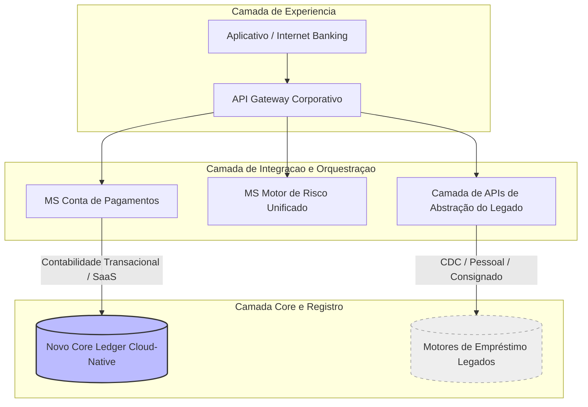

# ADR 001: Modernização do Core Bancário e Expansão de Portfólio do Banco Paulista de Expansão

## Status
Aprovado (Direcionamento Estratégico)

## Contexto
O Banco Paulista de Expansão precisa expandir seu portfólio de produtos, aumentar o engajamento diário dos clientes e modernizar seus sistemas core. O cenário atual apresenta as seguintes restrições e desafios de engenharia:
- **Silos Verticais:** Os produtos de Crédito e Empréstimos (CDC, Pessoal, Consignado, Garantias) rodam em silos isolados, com alto custo de manutenção e zero reaproveitamento de motores de crédito.
- **Falta de Funding:** A ausência de uma conta transacional própria exige captação de recursos a custos mais elevados.
- **Risco de Big Bang:** Uma substituição integral do core legado por um Core tradicional monolítico paralisaria novas entregas de negócio e geraria um projeto de alto risco com duração estimada de 3 a 5 anos.

Duas frentes de produto foram avaliadas para tração de engajamento: Conta de Pagamentos versus ferramentas de Cashback.

## Decisão
Decidimos adotar uma estratégia de **Next-Gen Core focada em Ledger Modular** e priorizar o lançamento da **Conta de Pagamentos**. A arquitetura TO-BE será implementada sob as seguintes diretrizes técnicas:

1. **Isolamento de Escopo do Ledger:** Adquiri-se uma plataforma de mercado moderna (*SaaS/Cloud-Native / API-First*) baseada em microsserviços via APIs exclusivamente para gerenciar saldos e lançamentos da nova Conta de Pagamentos.
2. **Preservação de Motores Legados:** Os produtos de empréstimos continuarão operando temporariamente em seus motores atuais. Eles serão encapsulados por uma camada unificada de APIs de Integração para expor suas capacidades de forma padronizada.
3. **Abordagem Arquitetural:** Manutenção do estilo descentralizado por microsserviços, quebrando os silos operacionais através de contextos delimitados (*Bounded Contexts*) e arquitetura orientada a eventos (*Event-Driven Architecture*).
4. **Priorização de Negócio:** Focar na Conta de Pagamentos em detrimento do Cashback pelas capacidades de geração de *funding* (depósitos de baixo custo), maior frequência de uso transacional (Pix/boletos) e facilidade de *cross-sell* estruturado para a carteira de crédito.

## Mapeamento de Domínios (DDD)
A divisão estratégica do subdomínios sob a ótica de Domain-Driven Design (DDD) fica estabelecida como:
- **Crédito e Empréstimos:** *Core Domain (Diferencial)* -> Onde reside o valor proprietário do banco.
- **Conta de Pagamentos:** *Core Domain (Alvo)* -> Principal ponto de contato e atração de depósitos.
- **Core Transacional / Ledger:** *Generic Subdomain* -> Tratado como commodity de mercado via SaaS.
- **Cashback e Parcerias:** *Supporting Subdomain* -> Despriorizado no plano atual.

## Consequências

### Positivas (Benefícios)
- **Time-to-Market Acelerado:** Redução drástica do risco do projeto ao evitar a abordagem "Big Bang". O Time-to-Market para novos produtos será reduzido em até 70% no longo prazo.
- **Geração de Funding:** Captura de depósitos à vista de baixo custo para alavancar a margem líquida (*spread*) das operações de crédito.
- **Foco da Engenharia:** Engenharia interna liberada para atuar no diferencial competitivo do banco (*Core Domain* de Crédito) enquanto delega a *commodity* de ledger para uma plataforma especializada.
- **Enriquecimento de Dados:** Volumetria de uso diário (Pix, boletos) gera massa crítica de dados para refinar os modelos de score de crédito.

### Negativas (Trade-offs e Riscos)
- **Complexidade de Integração:** Exige esforço imediato no desenho de uma malha robusta de microsserviços de negócio (Camada de Integração e Orquestração) para garantir a interoperabilidade entre os sistemas novos e antigos.
- **Dualidade de Ambientes:** Manutenção temporária de infraestruturas híbridas (motores legados locais coexistindo com o Core Ledger na nuvem).

## Roadmap de Execução Transicional

```mermaid
gantt
    title Cronograma de Transição de Arquitetura (18 Meses)
    dateFormat  X
    axisFormat %d

    section Fase 1: Fundação
    Deploy Core Ledger SaaS            :active, p1, 0, 6
    Criar MS Conta de Pagamentos      :active, p2, 0, 6
    Implementar API Gateway           :active, p3, 0, 6

    section Fase 2: Desacoplamento
    APIs sobre Silos de Empréstimo    :p4, 6, 12
    Unificação do Motor de Risco      :p5, 6, 12

    section Fase 3: Ecossistema Unificado
    Orquestração Transversal          :p6, 12, 18
    Migração de Legados Obsoletos     :p7, 12, 18
```

- **Fase 1 (Meses 1 a 6):** Foco em deploy do Core Ledger via SaaS/Cloud, criação do microsserviço de conta e implementação do API Gateway.
- **Fase 2 (Meses 6 a 12):** Construção da camada de abstração (APIs) sobre os silos de empréstimos e unificação do Motor de Risco de Crédito.
- **Fase 3 (Meses 12 a 18):** Orquestração de fluxos transversais (ex: automação de quitação de parcelas usando saldo) e mitigação/migração opcional de legados obsoletos.

